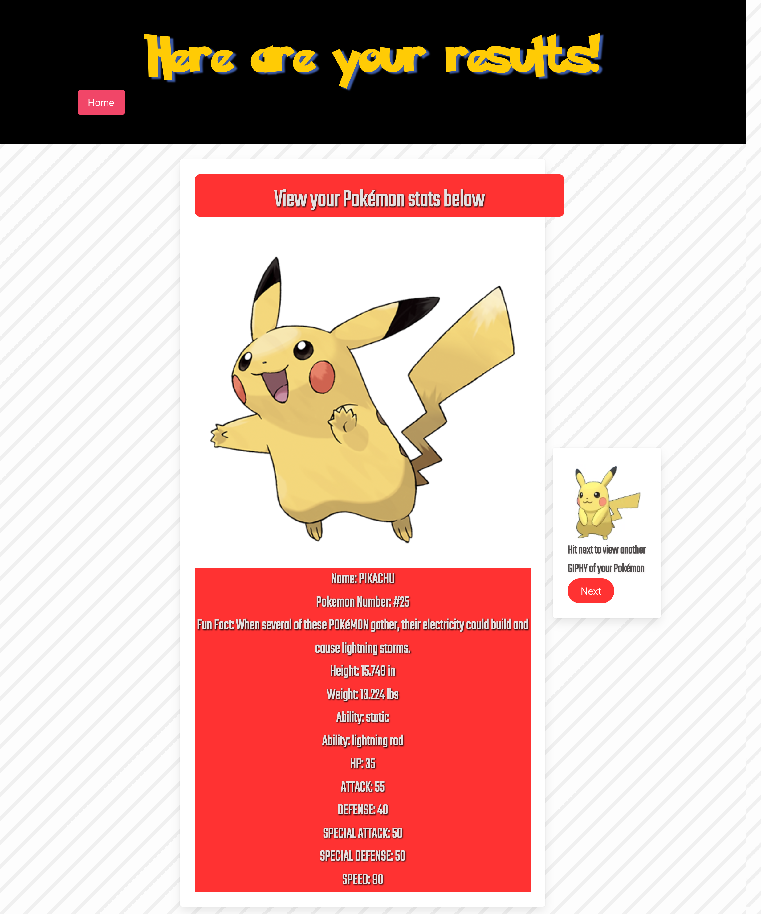

# Whos-that-Pokemon?

## Table of Contents

- [Installation](#installation)
- [Usage](#usage)
- [Credits](#credits)
- [License](#license)

## Description 
- This project was created to challenge us as a group to work together to be able to build a responsive website with a polished UI by applying everything we've learned throughout the first block of our course. Furthermore, it helped us better understand the importance of version control and using git to ensure that we have changes that we can revert to as well as learning how to address and fix any conflicting code. On the site the user will be prompted to search Pokémon API for a pokémon. User can enter in any Pokémon name and click search button to search Pokémon API for corresponding reslut or click Surprise for random search. User can then view results pulled from both Pokémon API and GIPHY API. 

## Installation
- N/A

## Usage 
- Navigate to: https://alexanderolivares13.github.io/Whos-that-Pokemon
- User will be prompted to search Pokémon API for a pokémon. User is prompted to enter in any Pokémon name and click search button to search Pokémon API for corresponding result. User is also prompted with option to click the "Surprise" button for randomly generated option as well. User then gets taken to new page with results of their search or randomized option. Results from Pokémon API "stats" will be listed along with a fun fact and an image of the said Pokémon. To the right of the page the GIPHY API will show result of corresponding Pokémon. The user will also be able to select the "Next" button to show another GIPHY API result for same Pokémon. The user also has option to search again by clicking the "Home" button on top left of results page. This will take user back to main search page. 

- Screenshot of Main Search page:

- Screenshot of Search results page:

## Credits
- Bulma CSS Framework: https://bulma.io/documentation/
- The Pokemon font used on the page: https://fonts.cdnfonts.com/css/pokemon-solid
- Jquery: https://code.jquery.com/jquery-3.7.0.min.js
- The Pokémon API: https://pokeapi.co/
- The GIPHY API: https://developers.giphy.com/
- The Pokémon images & names are property of Nintendo/Game Freak
- Collaberators: 
 - Elaine Martinez (Github: https://github.com/elainefmartinez)
 - Liam Robertson (Github: https://github.com/liam04290)

## License
- Please refer to the LICENSE in the Repo.